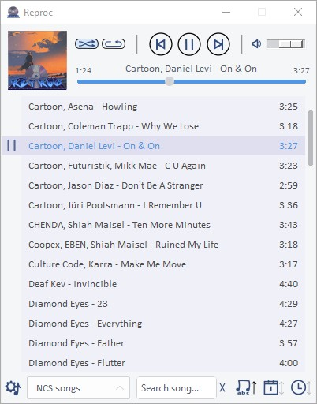
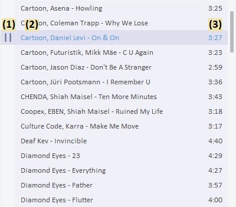
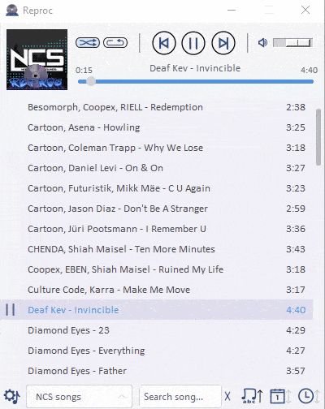
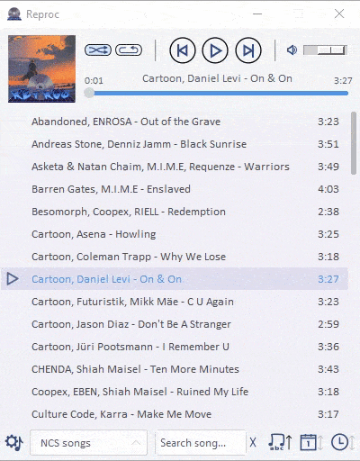
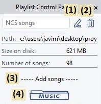

# REPROC - Music Player
Reproc is a free-open Local Music Player multiplaylists written in python.



---

# Running from source code
Python must be installed.

*From source code*
```
# Clone project
git clone https://github.com/JavideSs/reproc.git
cd reproc

# Install dependencies
pip install -r requirements.txt

# Run reproc
python reproc.py
```

*From source code with pipenv virtual environment*
```
# Clone project
git clone https://github.com/JavideSs/reproc.git
cd reproc

# Install pipenv if you do not have it
pip install pipenv

# Start pipenv environment
pipenv shell

# Install dependencies
pipenv install

# Run reproc
python reproc.py
```

---

# Reproc user guide
The interface can be divided into three parts:

- ### Playback control
A simple interface with functions common to many players.


*(1) Album cover art if there is one.  
(2) Play songs randomly.  
(3) Play songs in loop.  
(4) Play previous song.  
(5) Play or pause song.  
(6) Play next song.  
(7) Control volume.  
(8) Information about the current playback.*

- ### Playlist
List with all songs present in the playlist by name and duration.



*(1) Play or pause song.  
(2) Song name.  
(3) Song duration.*

It is sensitive to the mouse movement. When the mouse is passed over a song, it is colored and a button appears that can be clicked to start the song directly.



The application can be resized vertically.
Only the size of the playlist is affected, showing more or fewer songs.


Right clicking on a song, you can rename it, delete it or copy it to another playlist that has been imported in reproc.  
These actions will have a direct consequence on the disk.


*(1) Rename song.  
(2) Copy song to another playlist.  
(3) Delete song.*

- ### Playlist control
A bar to filter or modify the playlist.


*(1) Explained below.  
(2) Explained below.  
(3) Filter the playlist according to whether the songs have that character string contained in their names.  
(4) Sort the playlist by the song name in alphabetical order.  
(5) Sort the playlist by the song last modification on disk.  
(6) Sort the playlist by the song duration on disk.*

Displaying the menu you can select a playlist or add a new one to reproc.



Clicking on the button on the left will open a new window with some functions and information about the playlist.  
These actions will have a direct consequence on the disk.



*(1) Rename playlist.  
(2) Delete playlist from reproc. A warning will appear asking if you also want to delete it from the disk.  
(3) A window will appear to select song to add to the playlist.  
(4) Open the file explorer in the playlist path.*

---

## Keyboard shortcuts
- With the **SPACE KEY** you can continue or pause the song.
- With the **ENTER KEY** you can play the selected song in the playlist.
- With **DOUBLE CLICK** you can play the selected song in the playlist.
- With the **RIGHT/LEFT ARROWS KEYS** you can move forward/backward respectively 5s the current song.
- With the **CTRL + RIGHT/LEFT ARROWS KEYS** you can play the next/previous song.
- With the **UP/DOWN ARROWS KEYS** you can move through the playlist.

## Extra features

### Thumbnail toolbar
The application in the taskbar has buttons on the thumbnail to pause, continue or play previous or next song.  
This feature is present in Windows systems as of Windows 7.


## Audio formats
Unfortunately the pygame sld2 mixer interface for python only supports ogg for all platforms, and also mp3 for Windows.  
In addition, it is not possible to change the frequency dynamically, if a song is detected with a different frequency than the previous one, the mixer is reinitialized, which means a small delay of 1s.

## Data constancy
When closing the application the application state will be saved in "user_config.json".
These are: volume, status of random and loop, selected playlist, language, theme, playlists added to reproc an their filters.

### About "user_config.json"
Json structure:
[user_config.json](../data/user_config.json)

If there is a bug in the application that corrupts the structure, it could be modified directly in this file.  
For now, as there are no options to select theme or language, they can be set directly here.
- Two languages: english ("en") and spanish ("es").
- One theme: white ("normal")

Some theme colors can also be modified directly in this file. For a complete customization the tcl file could be modified.

---

Author:  
Javier Mellado Sánchez  
2020-2022